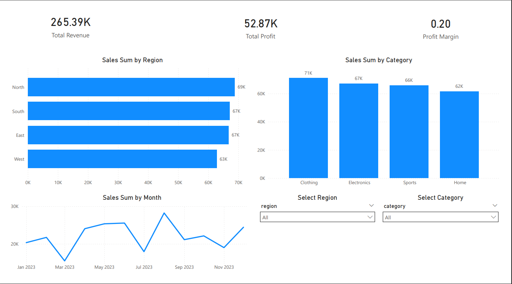

# 📊 Retail Sales Dashboard – End-to-End Analytics Project

This project is a concise, end-to-end analytics demonstration designed to showcase my ability to work across the full data workflow using:

- Python  
- PostgreSQL (SQL)  
- Power BI  

Rather than focusing on production-level complexity, this project highlights how I integrate data engineering, SQL validation, and business intelligence into a single, cohesive analytics solution.

---

## 🚀 Project Objective

Build a retail sales performance dashboard that:

- Loads raw CSV data using Python  
- Stores and validates data in PostgreSQL  
- Uses SQL for business metric verification  
- Builds interactive analytics in Power BI  
- Presents clear business insights in a professional dashboard layout  

---

## 🛠 Tech Stack

- **Python** – Data import & preprocessing  
- **PostgreSQL** – Relational database storage  
- **SQL** – Data validation and aggregation  
- **Power BI** – Data modeling, DAX, and visualization  
- **VS Code** – Development environment  
- **Git & GitHub** – Version control  

---

## 📂 Project Structure

```
Retail-Sales-Dashboard/
│
├── data/              # Raw dataset (CSV)
├── images/            # Dashboard screenshots
├── powerbi/           # Power BI (.pbix file)
├── sql/               # SQL validation queries
└── README.md
```

---

# 🧱 Step 1 – Data Engineering (Python → PostgreSQL)

### Data Import Workflow

Using Python:

- Loaded CSV dataset  
- Cleaned and formatted date fields  
- Validated numeric columns  
- Connected to PostgreSQL  
- Created and populated `retail_sales` table  

### PostgreSQL Table Schema

```sql
CREATE TABLE retail_sales (
    order_id VARCHAR,
    order_date DATE,
    region VARCHAR,
    category VARCHAR,
    revenue NUMERIC,
    profit NUMERIC,
    customer_name VARCHAR
);
```

---

# 🔎 Step 2 – SQL Data Validation

Before building visuals, all key metrics were validated using SQL queries in PostgreSQL.

### Total Revenue

```sql
SELECT SUM(revenue) AS total_revenue
FROM retail_sales;
```

### Total Profit

```sql
SELECT SUM(profit) AS total_profit
FROM retail_sales;
```

### Profit Margin

```sql
SELECT 
    SUM(profit) / SUM(revenue) AS profit_margin
FROM retail_sales;
```

### Revenue by Region

```sql
SELECT region, SUM(revenue) AS revenue
FROM retail_sales
GROUP BY region
ORDER BY revenue DESC;
```

### Monthly Revenue Trend

```sql
SELECT 
    DATE_TRUNC('month', order_date) AS month,
    SUM(revenue) AS monthly_revenue
FROM retail_sales
GROUP BY month
ORDER BY month;
```

This validation step ensured alignment between SQL outputs and Power BI metrics.

---

# 📊 Step 3 – Power BI Dashboard Development

## DAX Measures

```DAX
Total Revenue = SUM(retail_sales[revenue])

Total Profit = SUM(retail_sales[profit])

Profit Margin = DIVIDE([Total Profit], [Total Revenue])
```

## Dashboard Components

- KPI Cards (Revenue, Profit, Profit Margin)  
- Revenue by Region (Bar Chart)  
- Revenue by Category (Column Chart)  
- Monthly Revenue Trend (Line Chart – aggregated by Month-Year)  
- Top 10 Customers (Table)  
- Interactive Slicers (Region, Category, Date)  

---

# 🖼 Dashboard Preview

## Overview



---

# 📈 Key Insights

- Revenue distribution varies significantly across regions.  
- Certain product categories generate stronger profit margins.  
- Monthly trends reveal revenue seasonality.  
- A small subset of customers contributes a large share of revenue.  
- Profit margin fluctuations highlight potential pricing or cost differences.  

---

# 👤 Author

**Will Heffern**  
Aspiring Data Analyst  
Python | SQL (PostgreSQL) | Power BI  

---

## 📌 Summary

This project serves as a compact but complete demonstration of my ability to:

- Move data from raw files into a relational database  
- Validate metrics using SQL  
- Build clean, interactive dashboards  
- Translate data into business insights  

It reflects practical, hands-on analytics skills applied within a single integrated workflow.